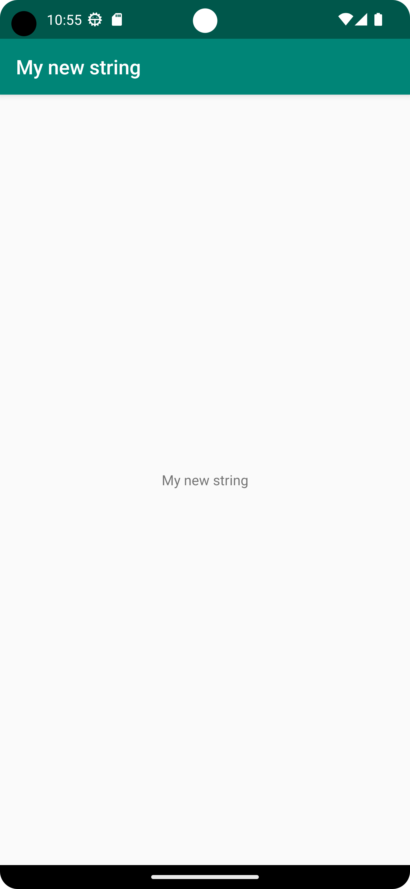

# Rapport

Uppgiften påbörjades genom att navigera till uppgiftens repository för att sedan skapa en fork. Fortsättningsvis så öppnades Android studio och projektet klonades ner till datorn. IDE:n konfiguruerades till att använda en "Google Pixel" som virtuell enhet och sedan testkördes programmet för att se till att programkoden exekverades utan fel. Texten som visades på skärmen i den virtuella miljön var då "Hello".

Under sökvägen `/app/src/main/res/values` finns en xml-fil som kallas "strings.xml". Denna fil innehåller en strängvariabel med identifieraren `app_name`. Variabelns data redigerades för att visa "My new string" i applikationen istället.

Nedan visas strängen `app_name` och det nya värdet.

```xml
<resources>
    <string name="app_name">My new string</string>
</resources>
```

Nedan kan ni se en bild på applikationen.




